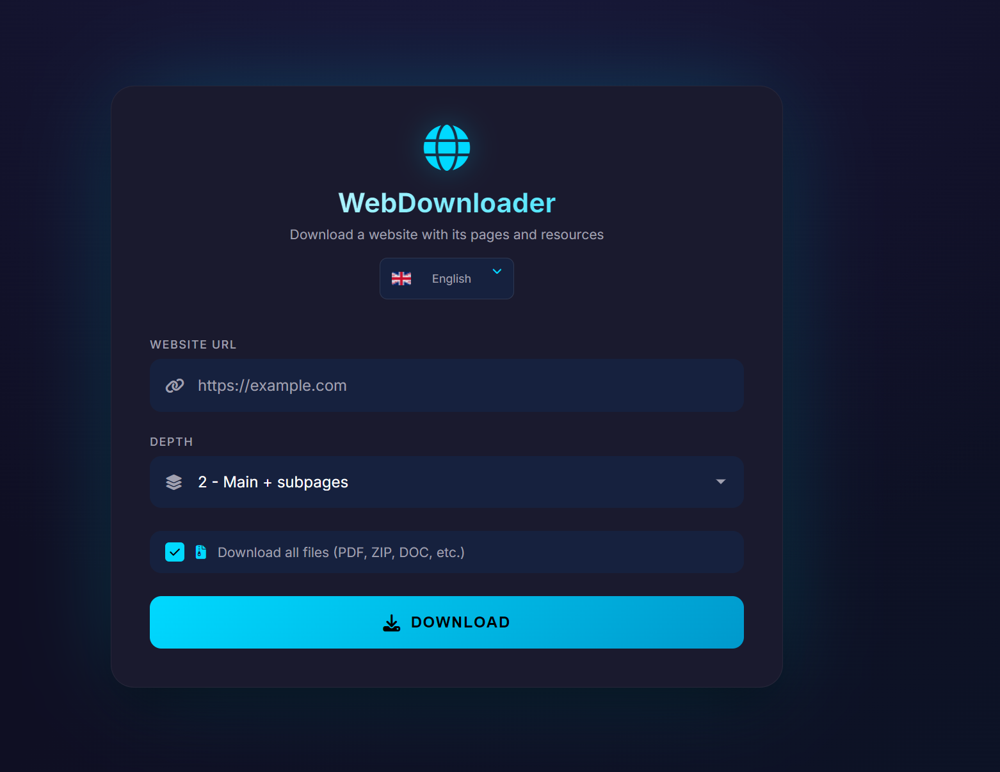

# WebDownloader

Desktop application for downloading websites with subpages, resources, and
attachments — written in **Go** with a **webview** UI.

The whole UI is a single HTML file embedded in the binary; the
application logic (HTTP fetching, HTML rewriting, BFS crawl) runs natively
in Go. No Node.js, no Electron, no separate web server.



## Features

- Recursive page download with configurable depth (1–5)
- Automatic asset downloading (images, CSS, JS, video posters, …)
- Optional attachment download (PDF, ZIP, DOC, … — 25 extensions)
- Multi-language UI (30+ languages, auto-detected)
- Live progress (pages, assets, attachments) and rolling log
- Native folder picker + "Open output folder" button
- Single-file portable executable

## Requirements

- **Go 1.22+** (tested on 1.26)
- **CGO** + a C compiler (GCC / MinGW on Windows — comes with `tdm-gcc`
  or installed via MSYS2 / Chocolatey)
- **Microsoft Edge WebView2** runtime (pre-installed on Windows 10/11 since
  2022; if missing download the Evergreen installer from
  <https://developer.microsoft.com/microsoft-edge/webview2/>)

## Quick start

```bat
git clone <repo>
cd webdownloader
go mod download
run.bat
```

`run.bat` builds the binary into `build\webdownloader.exe` (if missing)
and launches it. To rebuild from scratch:

```bat
build.bat
```

The resulting `build\webdownloader.exe` is fully self-contained
(HTML + translations embedded) and can be copied anywhere.

## Layout

```
.
├── main.go                  # entry point + webview bindings
├── pickdir_windows.go       # native folder picker (Windows, via PowerShell)
├── pickdir_other.go         # stub for non-Windows
├── internal/
│   ├── downloader/
│   │   ├── fetcher.go       # HTTP client (redirects, UA, timeout)
│   │   ├── html.go          # goquery-based HTML parsing & rewriting
│   │   ├── path.go          # URL → on-disk path mapping
│   │   └── downloader.go    # BFS orchestrator + event callbacks
│   └── locale/
│       └── locale.go        # system UI language detection
├── web/
│   ├── index.html           # UI (HTML + CSS + JS, single file)
│   └── i18n.json            # 30+ language translations
├── assets/
│   └── icon.png             # app icon
├── build.bat                # builds build\webdownloader.exe
├── run.bat                  # builds (if needed) and launches
└── go.mod
```

## CLI flags

```
webdownloader.exe [--debug]
```

- `--debug` — enable the webview DevTools (right-click → Inspect). Useful
  for tweaking the front-end; not needed by end users.

## How it works

1. The HTML page is embedded in the binary via `//go:embed web/*` and
   served to webview through `SetHtml`.
2. The Go side exposes a small RPC API to JS (`api_download`,
   `api_pickFolder`, `api_openFolder`, `api_getLocale`,
   `api_defaultOutputPath`, `api_i18n`).
3. `api_download` spawns a goroutine that runs the BFS crawl, emitting
   `progress`, `asset`, `error` and `complete` events back to the UI
   via `webview.Dispatch + Eval`.
4. The HTML rewriter uses `goquery` (a `cheerio`-style library) to find
   every relative asset reference (``, `<link>`, `<script>`,
   `<source>`, `<video>`), download it, and rewrite the `src`/`href`/
   `poster` attribute to a relative on-disk path. Inter-page `<a href>`
   links are rewritten similarly so the saved site is fully browseable
   offline.

## License

MIT.
